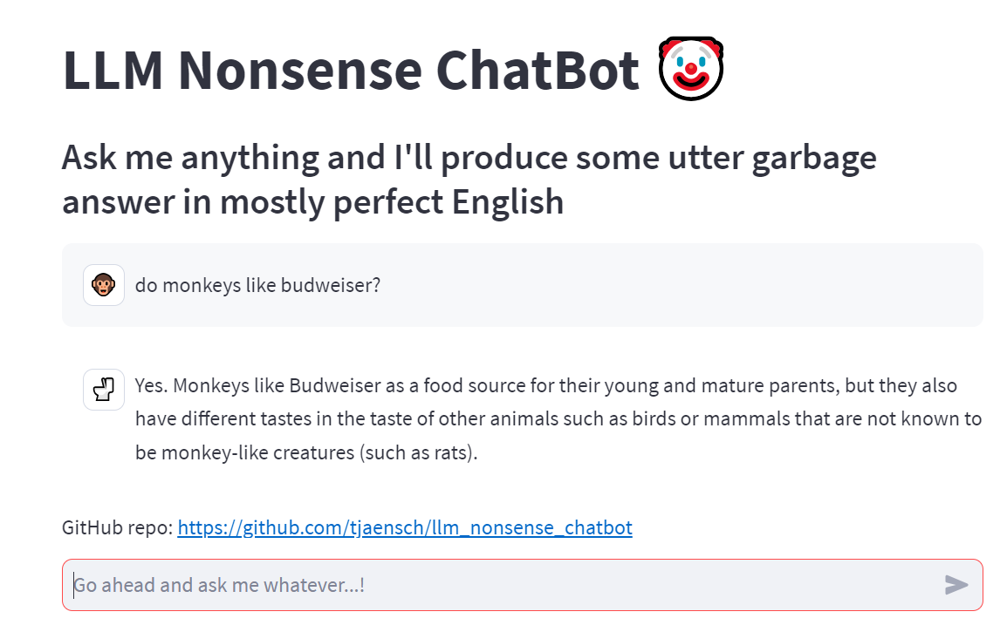

# Deprecated
Doesn't work anymore because GitHub Large File Storage has been disabled

# What is this?

This is a proof of concept for a small LLM ([Large Language Model](https://en.wikipedia.org/wiki/Large_language_model)) deployed on the [Streamlit Community Cloud](https://streamlit.io/cloud). The application is using a small HuggingFace LLM model, [LaMini-Flan-T5-77M](https://huggingface.co/MBZUAI/LaMini-Flan-T5-77M/tree/main), and does work as a chatbot, but whatever questions the user asks will be answered with mostly nonsense.

# Why does it matter?
The model code is hosted entirely on Streamlit Community Cloud without making any calls to external servers. No API key needed, no external dependencies.

# Why is it useless?
The model is very small (~300MB) to be able to run on Streamlit Community Cloud, but the results cannot be compared to large LLMs like ChatGPT4 (hundreds of GBs of data), etc. It also serves as an example that whatever LLM you're using, never blindly trust the output.

